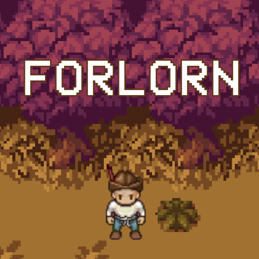

<!-- PROJECT LOGO -->
 

  

  <h3 align="center">Forlorn</h3>
  <h4 align="center">Codename: Full Steam</h4>

  

    An English Language Learning Game for Android
     
     
    <a href="https://github.com/full-steam/forlorn/issues">Report Bug</a>
  

<!-- TABLE OF CONTENTS -->
  <h2 style="display: inline-block">Table of Contents</h2>
  <ol>
    <li>
      <a href="#about-the-project">About The Project</a>
      <ul>
        <li><a href="#built-with">Built With</a></li>
      </ul>
    </li>
    <li><a href="#roadmap">Roadmap</a></li>
    <li><a href="#license">License</a></li>
    <li><a href="#contact">Contact</a></li>
    <li><a href="#acknowledgements">Acknowledgements</a></li>
  </ol>

<!-- ABOUT THE PROJECT -->
## About The Project

[![Forlorn Screen Shot][product-screenshot]](https://play.google.com/store/apps/details?id=com.FullSteam.Forlorn)

    <strong>Forlorn</strong> (codenamed <em>Project Full Steam</em>) is an English language learning game for Windows. Play as the Adventurer who's trying to find his way home in the land of Viridia where everyone speaks English! Explore Forlorn's fantasy world that is full of mysteries! Learn English by interacting with the characters and people that live in this world! The game is available for free on Google Play Store <a href="https://play.google.com/store/apps/details?id=com.FullSteam.Forlorn">here</a>.

    Forlorn was developed as our final thesis project, which title was "Forlorn: English Language Learning Mobile Game Based on the Input Hypothesis and Comprehensible Output Hypothesis". The goal of the project was to aid Indonesian university students in improving their English language skills, specifically for B2-level English. Research methods included studying existing literature, interviews with an expert, and a test conducted before and after playing the game. Based on the tests and surveys to 32 participants in the target age range, there was an increase in B2-level English language ability ranging from a 5% increase to an 89% increase. It was thus concluded that the game was effective in aiding English language learning.

    Anyone who comes across this project is welcome to see the project. However, you may not use any part of this repository for your own purposes without first confirming with us.

### Built With

This project was built using the [Unity](https://unity.com/) game engine (version 2020.2.1).

<!-- ROADMAP -->
## Roadmap

See the [open issues](https://github.com/full-steam/forlorn/issues) for a list of known issues.

<!-- LICENSE -->
## License

You may not use Forlorn or any of its assets for any commercial or non-commercial purposes. All rights belong to us. For any questions, please contact us.

<!-- CONTACT -->
## Contact

Project Full Steam - fullsteam751@gmail.com

Phobez (producer/project manager/project lead) - [itch.io page](https://phobez.itch.io/)

Project Link: [https://github.com/full-steam/forlorn](https://github.com/full-steam/forlorn)

<!-- ACKNOWLEDGEMENTS -->
## Acknowledgements

* [Best-README-Template](https://github.com/othneildrew/Best-README-Template)

<!-- MARKDOWN LINKS & IMAGES -->
[product-screenshot]: images/screenshot.jpg
